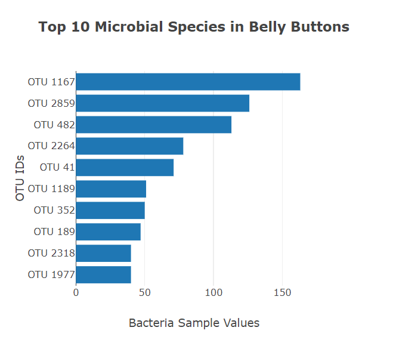
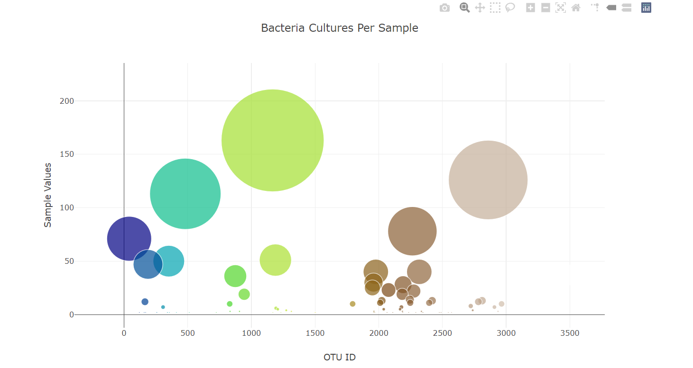
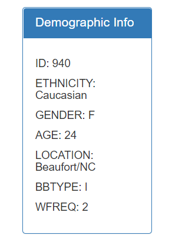
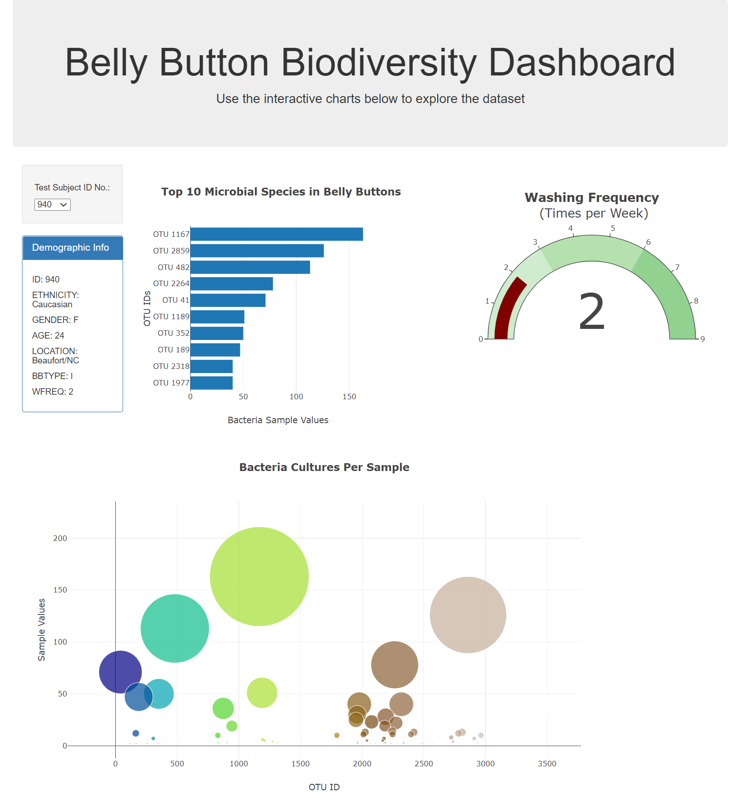
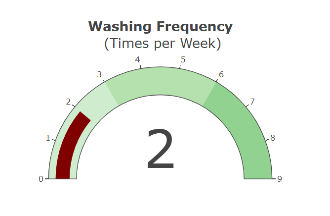

# Belly-Button-Biodiversity

In this project, an interactive dashboard was built to explore the [Belly Button Biodiversity dataset](http://robdunnlab.com/projects/belly-button-biodiversity/), which catalogs the microbes that colonize human navels.

The dataset reveals that a small handful of microbial species (also called operational taxonomic units, or OTUs, in the study) were present in more than 70% of people, while the rest were relatively rare.

## Creation of Belly-Button-Biodiversity Dashboard

Completed the following steps:

1. Used the D3 library to read in `samples.json`

2. Created a horizontal bar chart with a dropdown menu to display the top 10 OTUs found in that individual.

  * Used `sample_values` as the values for the bar chart.
  * Used `otu_ids` as the labels for the bar chart.
  * Used `otu_labels` as the hovertext for the chart.

  

3. Created a bubble chart that displays each sample.

  * Used `otu_ids` for the x values.
  * Used `sample_values` for the y values.
  * Used `sample_values` for the marker size.
  * Used `otu_ids` for the marker colors.
  * Used `otu_labels` for the text values.

4. Displayed the sample metadata, i.e., an individual's demographic information.

5. Displayed each key-value pair from the metadata JSON object on the page.

6. Updated all the plots when a new sample is selected.

`Here is the Belly Button Biodiversity Dashboard created:`

7. Deployed the app as a GitHub Page.
 [GitHub Page](https://indranandagopal.github.io/Belly-Button-Biodiversity/)

## Advanced Challenge 

* Implemented the `Advanced Challenge` in `app.js` file itself.

* Adapted the Gauge Chart from <https://plot.ly/javascript/gauge-charts/> to plot the weekly washing frequency of the individual.

* Updated the gauge code to account for values ranging from 0 through 9.

* Updated the chart whenever a new sample is selected.

